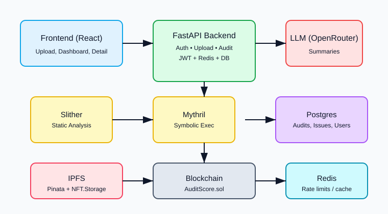
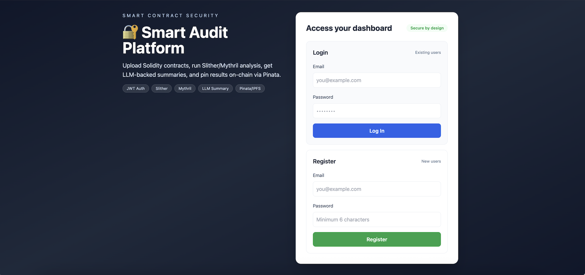
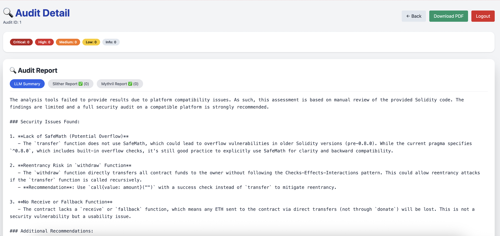
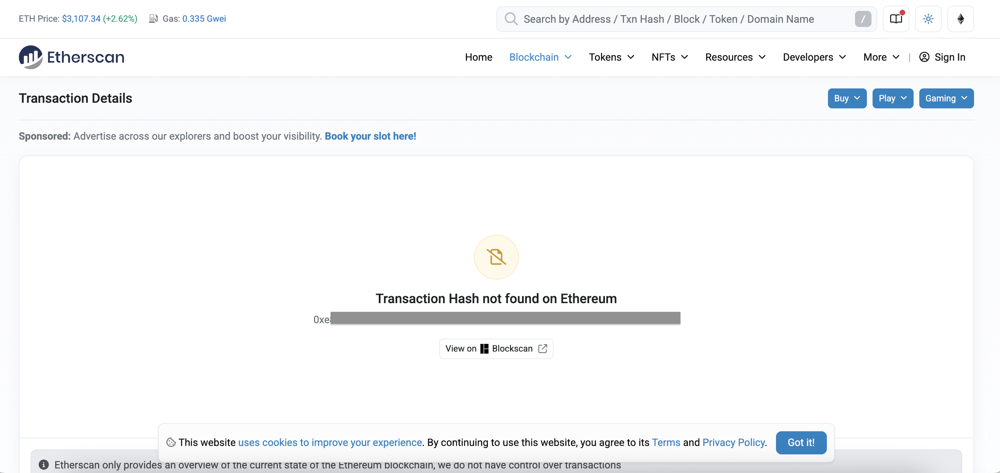

# Smart Audit – AI-Powered Smart Contract Auditor

<div align="center">


**AI-Powered Smart Contract Security Auditor • Slither + Mythril + LLM • CVSS scoring • NFT-based verification • CI/CD with GitHub Actions**

[Features](#key-features) • [Quick Start](#quick-start) • [Architecture](#architecture) • [API Docs](#api-routes) • [Contributing](CONTRIBUTING.md)

</div>

---

### 🚀 Tech Stack


### ✨ Project Highlights

- 🔍 **Hybrid Analysis**: Combines static analysis (Slither/Mythril) with LLM-powered insights
- 📊 **CVSS Scoring**: Automated risk assessment with A-F grading system
- 🌐 **Decentralized Storage**: Dual IPFS pinning (Pinata + NFT.Storage)
- ⛓️ **On-Chain Records**: Immutable audit records via smart contracts
- 🔐 **Enterprise Ready**: JWT authentication, audit history, detailed reporting
- 🐳 **Docker Native**: One-command setup with docker-compose
- 🧪 **CI/CD**: Automated testing and deployment pipelines

## Overview

Smart Audit is a comprehensive hybrid security analysis platform for Solidity smart contracts. It combines static analysis tools (Slither and Mythril) with LLM-powered post-processing to provide detailed vulnerability reports, CVSS risk scoring, IPFS storage, and on-chain audit record storage.

### Key Features

- 🔍 **Static Analysis**: Slither and Mythril integration for automated vulnerability detection
- 🤖 **AI-Enhanced**: LLM post-processing via OpenRouter for context-aware analysis
- 📊 **Risk Scoring**: CVSS-based security grading (A-F scale)
- 🌐 **IPFS Storage**: Dual pinning to Pinata and NFT.Storage for decentralized report storage
- ⛓️ **On-Chain Records**: Audit results stored on blockchain via AuditScore.sol contract
- 🔐 **Authentication**: JWT-based user authentication with audit history tracking
- 📱 **Modern UI**: React + Vite frontend with detailed audit views and verification tools

## Architecture



### System Components

- **Frontend (React + Vite)**: User interface for uploading contracts, viewing audit history, and verifying results
- **Backend (FastAPI)**: REST API handling authentication, audit processing, and blockchain/IPFS operations
- **Static Analyzers**: Slither (static analysis) and Mythril (symbolic execution)
- **LLM Integration**: OpenRouter API for intelligent report generation
- **Storage**: PostgreSQL for audit records, Redis for caching
- **IPFS**: Dual pinning via Pinata and NFT.Storage
- **Blockchain**: Web3 integration for on-chain audit record storage

## Screenshots

### Dashboard


### Audit Detail View


### Contract Verification


## Quick Start

### Prerequisites

- Docker and Docker Compose
- Node.js 18+ (for local frontend development)
- Python 3.10+ (for local backend development)
- Web3 provider (local node or Infura/Alchemy)
- OpenRouter API key
- Pinata JWT (optional, for IPFS)
- NFT.Storage token (optional, for dual IPFS pinning)

### Docker Setup (Recommended)

1. **Clone the repository**
   ```bash
   git clone <repository-url>
   cd smart-audit
   ```

2. **Configure environment variables**
   ```bash
   # Root .env for docker-compose
   cp .env.example .env
   
   # Backend configuration
   cp smart-audit-backend/env.example smart-audit-backend/.env.backend
   # Edit smart-audit-backend/.env.backend with your secrets
   
   # Frontend configuration (if developing locally)
   cp smart-audit-frontend/.env.example smart-audit-frontend/.env
   ```

3. **Start services**
   ```bash
   # Standard start
   docker-compose up --build
   
   # For ARM/M1 Macs (static tools may be skipped)
   docker-compose up --build
   
   # For full Slither/Mythril on ARM (requires emulation)
   DOCKER_DEFAULT_PLATFORM=linux/amd64 docker-compose up --build
   ```

4. **Access the application**
   - Frontend: http://localhost:3000
   - Backend API: http://localhost:8000
   - API Docs: http://localhost:8000/docs

### Local Development

#### Backend Setup

```bash
cd smart-audit-backend
python -m venv venv
source venv/bin/activate  # On Windows: venv\Scripts\activate
pip install -r requirements.txt

# Set up environment
cp env.example .env.backend
# Edit .env.backend with your configuration

# Run migrations (if needed)
# Apply smart-audit-backend/migrations/init.sql
# Apply smart-audit-backend/migrations/add_issues_columns.sql

# Start backend
uvicorn app.main:app --reload --host 0.0.0.0 --port 8000
```

#### Frontend Setup

```bash
cd smart-audit-frontend
npm install
cp .env.example .env
# Edit .env with VITE_API_URL

# Start dev server
npm run dev
```

## Environment Variables

### Root `.env` (for docker-compose)

```env
POSTGRES_USER=postgres
POSTGRES_PASSWORD=postgres
POSTGRES_DB=smart_audit
VITE_API_URL=http://localhost:8000
```

### Backend `.env.backend`

```env
DATABASE_URL=postgresql://postgres:postgres@db:5432/smart_audit
REDIS_URL=redis://redis:6379
SECRET_KEY=changeme
WEB3_PROVIDER=http://host.docker.internal:8545
PRIVATE_KEY=your_private_key_here
CONTRACT_ADDRESS=0xYourContract
PINATA_JWT=your_pinata_jwt
PINATA_GATEWAY=https://gateway.pinata.cloud/ipfs
NFT_STORAGE_TOKEN=your_nft_storage_token
OPENROUTER_API_KEY=your_key
FORCE_ANALYSIS_ON_ARM=false
```

### Frontend `.env`

```env
VITE_API_URL=http://localhost:8000
```

## API Routes

### Authentication

| Method | Endpoint | Description | Auth Required |
|--------|----------|-------------|---------------|
| POST | `/auth/register` | Register new user | No |
| POST | `/auth/login` | Login and get JWT token | No |
| POST | `/auth/token` | OAuth2 token endpoint | No |

### Audit Operations

| Method | Endpoint | Description | Auth Required |
|--------|----------|-------------|---------------|
| POST | `/upload` | Upload and audit contract | Yes |
| GET | `/my-audits` | Get user's audit history | Yes |
| GET | `/audit/{audit_id}` | Get detailed audit result | Yes |

### Verification

| Method | Endpoint | Description | Auth Required |
|--------|----------|-------------|---------------|
| GET | `/verify/{contract_hash}` | Verify contract by hash | No |

## NFT Minting & IPFS Integration

Smart Audit supports dual IPFS pinning for audit reports:

1. **Pinata**: Primary IPFS pinning service (requires `PINATA_JWT`)
2. **NFT.Storage**: Secondary pinning for redundancy (requires `NFT_STORAGE_TOKEN`)

When an audit is completed:
- Report JSON is generated with all vulnerabilities and scores
- Report is pinned to Pinata (primary CID returned)
- If `NFT_STORAGE_TOKEN` is configured, report is also pinned to NFT.Storage
- Both CIDs are stored in the database and returned in API responses
- On-chain record includes the primary CID

To access IPFS content:
- Pinata: `https://gateway.pinata.cloud/ipfs/{cid}`
- NFT.Storage: `https://nftstorage.link/ipfs/{cid}`

## Database Migrations

Apply migrations in order:

1. `smart-audit-backend/migrations/init.sql` - Initial schema
2. `smart-audit-backend/migrations/add_issues_columns.sql` - Adds `slither_issues`, `mythril_issues`, and `cid_nft` columns

## ARM/M1 Mac Compatibility

On ARM-based Macs (M1/M2), static analysis tools may have compatibility issues:

- **Default behavior**: Static tools are skipped, only LLM analysis runs
- **Force analysis**: Set `FORCE_ANALYSIS_ON_ARM=true` in `.env.backend` (may fail)
- **Full compatibility**: Use `DOCKER_DEFAULT_PLATFORM=linux/amd64` for emulation

## Testing

### Backend Tests

```bash
cd smart-audit-backend
pytest tests/ --cov=app
```

### Frontend Tests

```bash
cd smart-audit-frontend
npm test
```

## CI/CD

The repository includes GitHub Actions workflows:

- **`.github/workflows/ci.yml`**: Runs on every push/PR, builds Docker images
- **`.github/workflows/audit.yml`**: Comprehensive testing including Slither analysis

## Tested Environment Versions

- Python: 3.10, 3.11
- Node.js: 18.x
- PostgreSQL: 14
- Redis: 7
- Docker: 20.10+
- Solidity: 0.8.x (compiled with solc 0.8.20)

## Project Structure

```
smart-audit/
├── smart-audit-backend/      # FastAPI backend
│   ├── app/
│   │   ├── blockchain/       # Web3 integration
│   │   ├── llm/              # LLM wrapper
│   │   ├── models/           # SQLModel schemas
│   │   ├── routes/           # API endpoints
│   │   ├── services/         # Business logic
│   │   └── utils/            # Utilities
│   ├── migrations/           # Database migrations
│   ├── smart-audit-chain/    # Foundry contracts
│   └── Dockerfile
├── smart-audit-frontend/     # React frontend
│   ├── src/
│   │   ├── components/       # React components
│   │   ├── pages/           # Page components
│   │   └── main.jsx
│   └── Dockerfile
├── docs/
│   └── img/                  # Documentation images
├── docker-compose.yml
└── README.md
```

## Security Notes

- **Never commit** `.env` files or `.env.backend` files
- Keep `SECRET_KEY` secure and rotate regularly
- Store `PRIVATE_KEY` securely (consider hardware wallets for production)
- API keys should be stored as GitHub secrets for CI/CD

## Contributing

See [CONTRIBUTING.md](CONTRIBUTING.md) for guidelines.

## License

MIT

## Disclaimer

- Static analysis tools (Slither/Mythril) may not detect all vulnerabilities
- LLM analysis is a supplement, not a replacement for manual audit
- On ARM architectures, static analysis may be skipped or fail
- Always conduct comprehensive security audits before deploying contracts to mainnet
